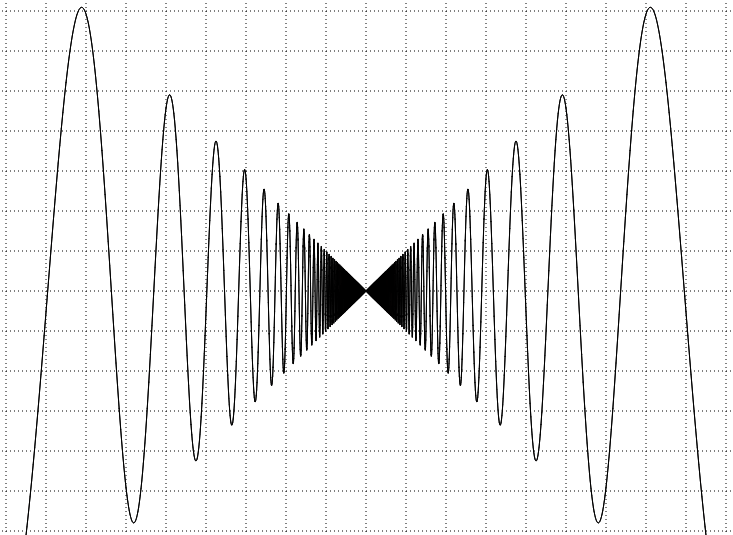
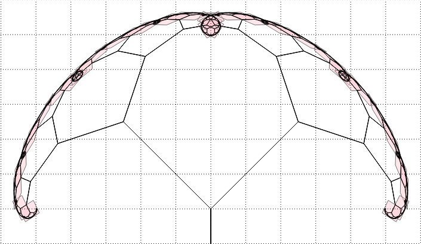

# Exact Function/Curve/Fractal Plotter

A web-browser widget for plotting rigorously computed arbitrarily-accurate enclosures of function graphs, parametric curves and fractals defined by curves and affine transformations.

[Try it now](http://duck.aston.ac.uk/konecnym/plotter/)

Also, see the [screenshots folder](screenshots) and [slides](regional-cstaster-MK-cid-slides.pdf) featuring plots produced by this tool.

_Beware: Work in progress. Currently the UI and plotting is very slow._

<!-- Screenshots: -->

