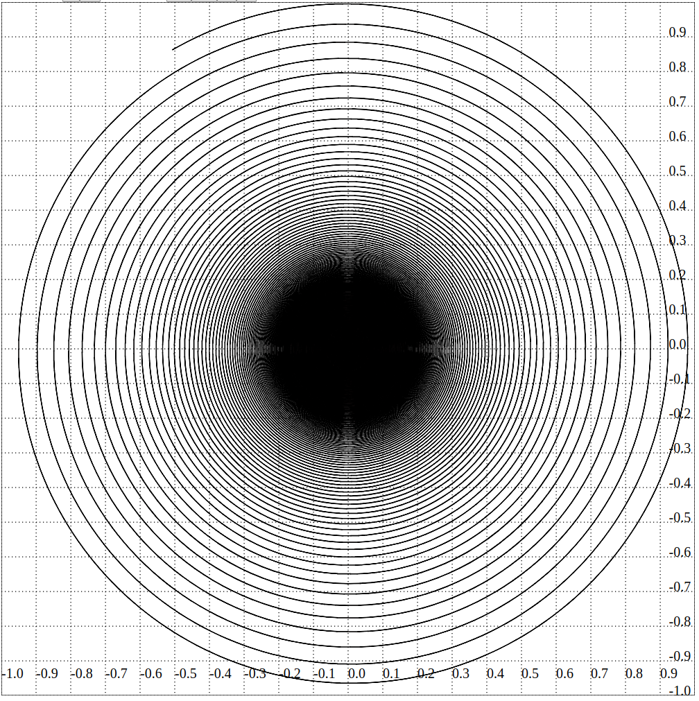
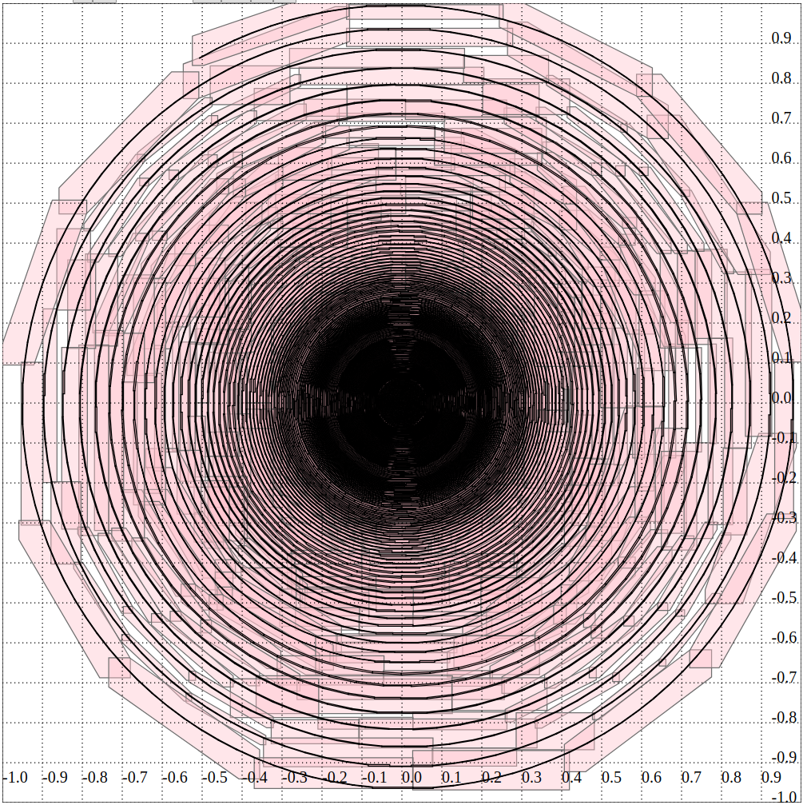
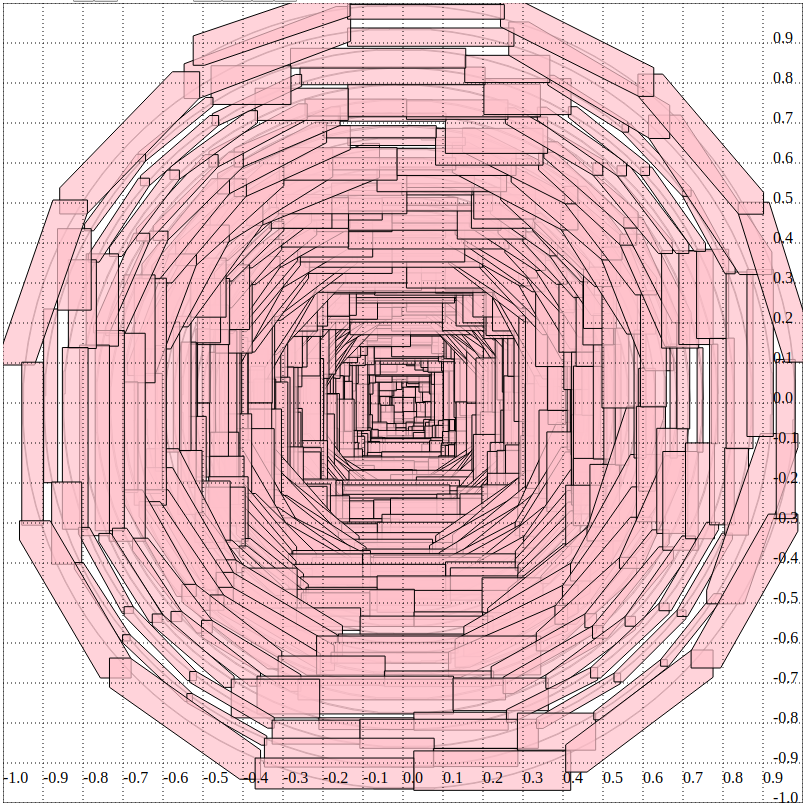

# Exact Function/Curve/Fractal Plotter

A web widget for reliably plotting function graphs, parametric curves and certain fractals.

[Try it now!](http://duck.aston.ac.uk/konecnym/plotter/)

_Beware: The UI and plotting is quite slow due to the cost of reliable arbitrary-accuracy arithmetic running within your browser._

To speed up rendering, tune the plots with very low accuracy and increase accuracy only for the final rendering.

## Examples

The above images are obtained by drawing shapes that **reliably enclose** the exact objects.
In particular, rounding errors are correctly accounted for.
These graphical enclosures can be computed to an **arbitrarily high accuracy**.  
In the images below the same objects are plotted with a **low accuracy** so that the shapes are easy to see.

The following are high and low accuracy plots of an infinitely winding spiral:

Also, see the [screenshots folder](screenshots) and [slides for a school outreach](regional-cstaster-MK-cid-slides.pdf) featuring plots produced by this tool. 

<!-- Screenshots: -->

