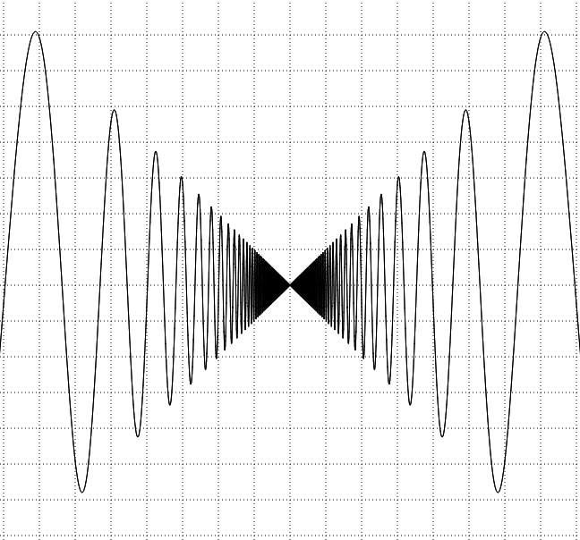
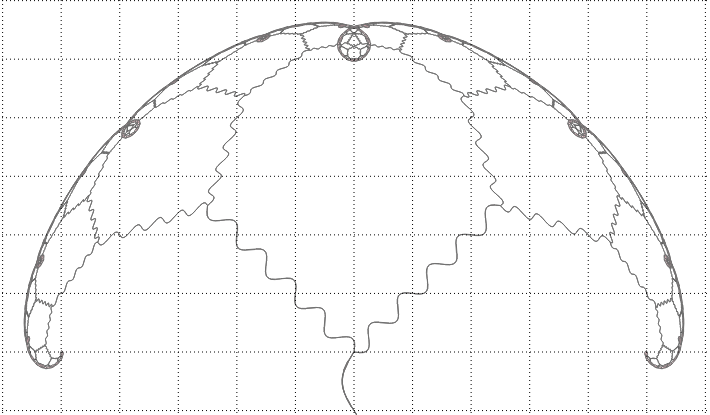
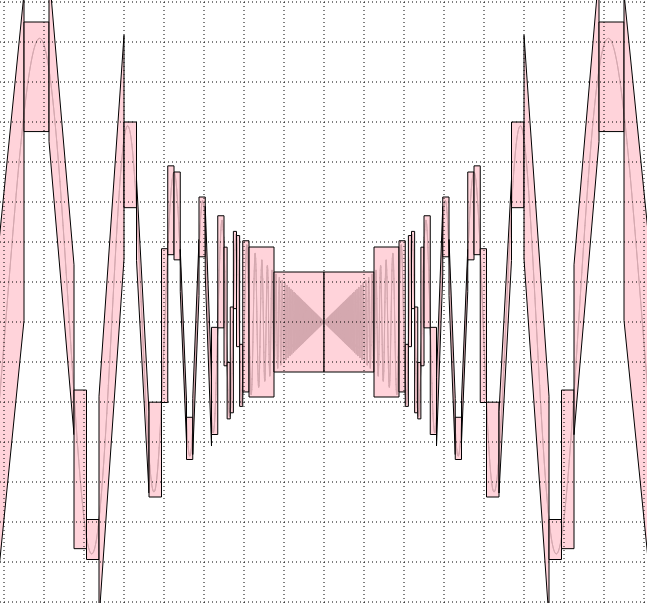
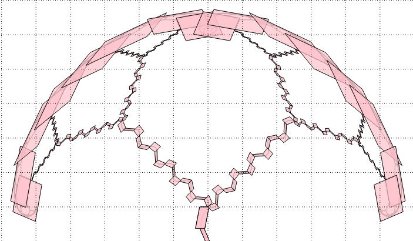

# Exact Function/Curve/Fractal Plotter

A web-browser widget for reliably plotting function graphs, parametric curves and certain fractals.

The above images are obtained by drawing shapes that **reliably enclose** the exact objects.
In particular, rounding errors are correctly accounted for.
These graphical enclosures can be computed to an **arbitrarily high accuracy**.  
In the images below the same objects are plotted with a **low accuracy** so that the shapes are easy to see.

[Try it now](http://duck.aston.ac.uk/konecnym/plotter/)

Also, see the [screenshots folder](screenshots) and [slides](regional-cstaster-MK-cid-slides.pdf) featuring plots produced by this tool.

_Beware: Work in progress. Currently the UI and plotting is slow._

I recommend to tune the plots with very low accuracy and increase accuracy only for the final rendering.
In case of fractals, accurate rendering typically takes several minutes.

<!-- Screenshots: -->

